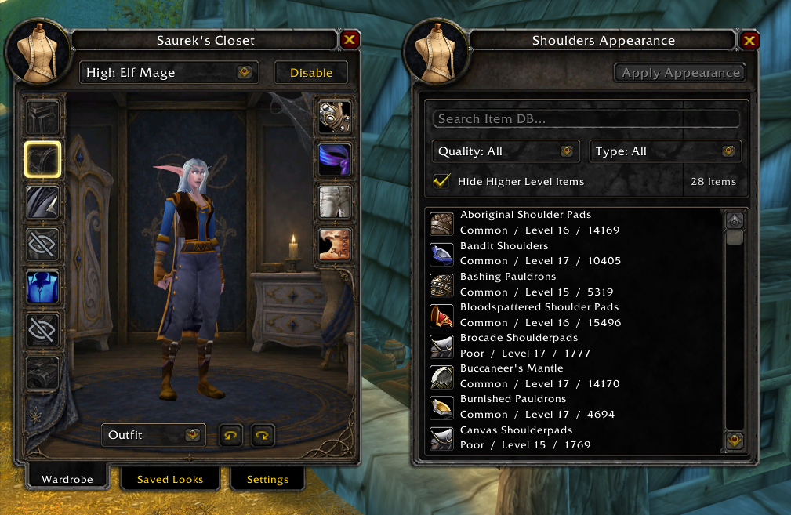
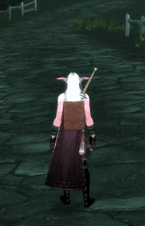
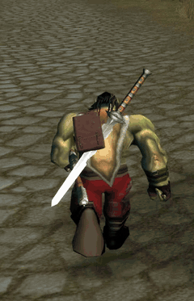
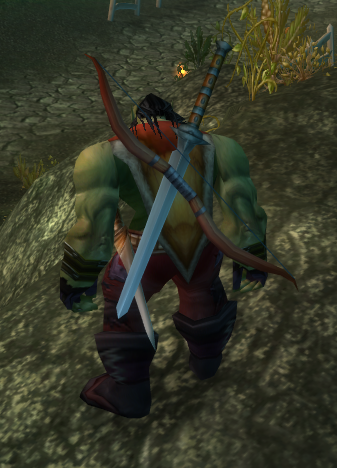
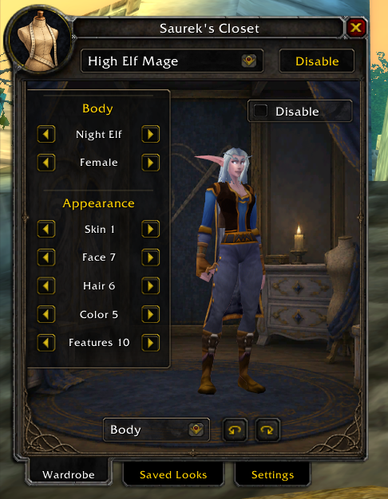
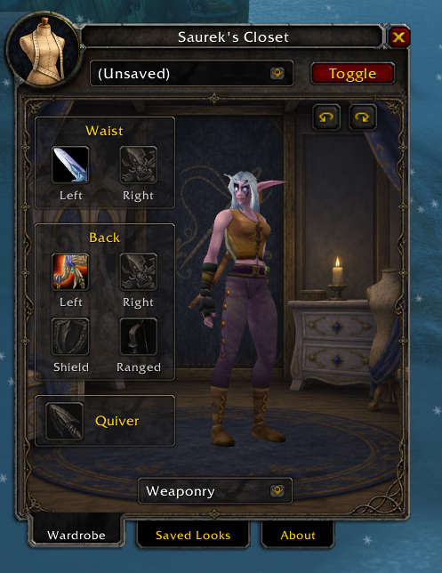
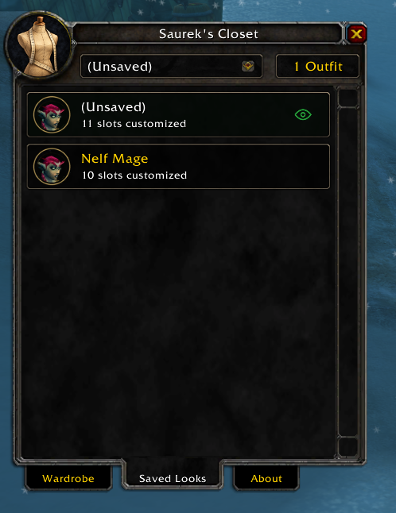

<div align="center">

# Saurek's Closet - A Damn Fine 1.12 Transmog

Supported on Linux, Windows, and Mac

<a href="https://discord.gg/6mfxCdNbM6"></a>

[Join the Discord community](https://discord.gg/6mfxCdNbM6)

</div>

## Your character, your look

Saurek's Closet morphs how your character looks on your own client, and for others with the addon. Your actual equipment, stats, and gameplay stay the same.

- **Dress your character:** browse the item database, filter by quality and type, and preview an item before activating it.
- **Choose what shows:** customize an armor slot, hide it, or pass through your real equipment.
- **Customize your body:** change race, gender, skin, face, hair, and available features.
- **Arrange your weaponry:** select appearances for both sides of the waist, both sides of the back, a shield, a ranged weapon, and a quiver. Or all at once!
- **See your bags:** Equip and position your bags on your back and hips.
- **Advanced physics:** Optionally enable modern pre-computed (baked) cape, bag, sheathed weapon physics with no runtime performance cost. Watch as jumping, running, falling, and combat motions realistically deform and swing your equipment on your character!
- **Get dirty:** Sweat, dust, mud, and blood. It gets all over you, and you'll need to visit an inn, or take a dip to clean it off.
- **Share your look with others:** If another player has the addon they can see your custom look (if you authorize broadcasting your transmog data)


## Take a look inside

### Wardrobe & item browser



### Visible Bags with dynamic physics

- 15 bag models with soft and hard physics systems based on the bag type. Equip and precisely position up to 3 bags on the back and 2 on the hips.
- Bags stay consistently sized for realism. A Runecloth bag on a gnome would take up their whole back, versus a Tauren that could comfortably fit 4 or more. In the bag precision tuner you can adjust their size if you want to.
- Hard physics: Hard leather bags rock and bounce realistically, as if they had weight. Jumping/falling causes the bag to tilt and fly up in the air realistically.
- Soft physics: cloth bags are simulated with different sized cubes jostling around inside the bags in Blender, using motion vectors extracted from all race and gender combos performing different animations. The resulting bag movements are recoded and baked into the game. This makes it appear as if advanced source engine style physics are utilized with no runtime cost.
- Intelligent strap creation (Not shown in demo gifs) the addon computes a strap line from each bag to the players shoulder and draws it over the player texture in memory.

<table>
<tr>
<td width="50%">

</td>
<td width="50%">

</td>
</tr>
</table>

### Expanded weapon positioning, and fixes for Blizzard's 1.12 weapon sheathing bugs

- Greatly expand your ability to choose where items are placed on the body. Put your fishing rod on your back with a weapon, and your skinning knife on your hip, all at once.

- Or as a hunter see your bow and quiver at all times, even with your sword on your back, and adjust the position of the quiver.



### Body customization



### Weaponry



### Saved Looks



## Installation

### What you need

- The supported **Windows 1.12.1 client, build 5875**. This is not an addon for modern WoW Classic or Retail. Other clients may be possible to be support, open a Github issue.
- **VanillaFixes** configured to launch your game.
- **VanillaHelpers.dll** installed and enabled in `dlls.txt`.
- Both parts of Saurek's Closet: the **`SaureksCloset` addon folder** and **`SaureksCloset.dll`** from the release download.

### Privacy Notes

- Vanilla Closet has a "Check for updates" feature that queries this Github page to see if an update is available. This feature can be disabled in settings. It's able to do this while other addons cannot because it uses memory injection to take full control of the game client and escape Blizzard's addon jail.

### Install the release

1. Fully close World of Warcraft and extract the release ZIP.

2. Copy the `SaureksCloset` folder into `Interface/AddOns/`.

3. Open the addon's **[Installation instructions](Installation%20instructions/)** folder. Copy the included `SaureksCloset.dll` into your main game folder, beside `WoW.exe`. The short [setup guide](Installation%20instructions/READ%20ME.txt) explains where to drag it.

4. Add `SaureksCloset.dll` to `dlls.txt`, after `VanillaHelpers.dll`. Keep any other DLL entries you already use.

5. Launch through VanillaFixes, enable **Saurek's Closet** in the AddOns list, and log in.

Your installation should contain:

```text
World of Warcraft/
├── WoW.exe
├── VanillaHelpers.dll
├── SaureksCloset.dll
├── dlls.txt
└── Interface/
    └── AddOns/
        └── SaureksCloset/
            ├── SaureksCloset.toc
            ├── Textures/
            └── ...
```

**Don't forget the DLL.** Copying only the addon folder is not a complete installation. A UI reload cannot load a new DLL; fully restart the game after replacing one.

The full release also includes an optional Python 3 installer, which verifies the supported client and backs up the files it replaces:

```powershell
py -3 install.py "C:\Games\World of Warcraft"
```

## Make your first look

1. Click the minimap button or type **`/closet`**.
2. In **Wardrobe → Outfit**, click an armor slot and choose **Custom Item**, **Hide Slot**, or **Passthrough**.
3. Search or filter the item list. Click an item to preview it, then choose **Activate Item** to apply it.
4. Use the bottom dropdown to visit **Body** or **Weaponry** and continue customizing.
5. Open **Saved Looks** and select **(Unsaved)**. Enter a name and click **Save new**, or use **Save to existing outfit** to update a favorite.

Open any saved look to preview, rename, delete, or activate it. The green eye marks the active look. The dropdown at the top of the window lets you switch saved looks quickly, and **Toggle** turns your local appearance overrides on or off.

### How weapon placements work

Several custom weapons can be displayed at once. When you draw weapons, matching appearances move into your hands according to the type of weapon actually equipped. A cosmetic gun stays stored if you don't have a gun equipped; unmatched placements and quivers also stay stored.

Weaponry is still being refined. Some combinations may clip, and attachment positions cannot yet be adjusted manually. The **Bags** view is a placeholder; bag appearance customization is not available yet.

### Can I get banned from a private server for using this?

Probably not. Warden could in theory detect it, but I would think it's unlikely considering it only changes player object related properties.

If you enable transmog broadcasting so other players with the addon can see your custom look: the server can see you are using Saurek's Closet.

## Licensing

### Source Code

Unless otherwise stated, the source code in this repository is licensed under
the GNU General Public License v3.0. See [LICENSE](LICENSE).

### Artwork and Assets

Original artwork, textures, graphics, interface artwork, icons, images, audio,
and other creative assets included with Saurek's Closet are proprietary,
separately licensed, and are not covered by the GPLv3. See
[ASSETS-LICENSE](ASSETS-LICENSE).

Apart from installation, use with Saurek's Closet, personal backups, and other
permissions described in that license, these assets may not be extracted,
copied, modified, redistributed, or used in another project without explicit
permission from the copyright holder.

Third-party assets, including assets derived from or owned by Blizzard
Entertainment, remain subject to the rights of their respective owners.
Permissions already granted under prior licenses remain unaffected.


