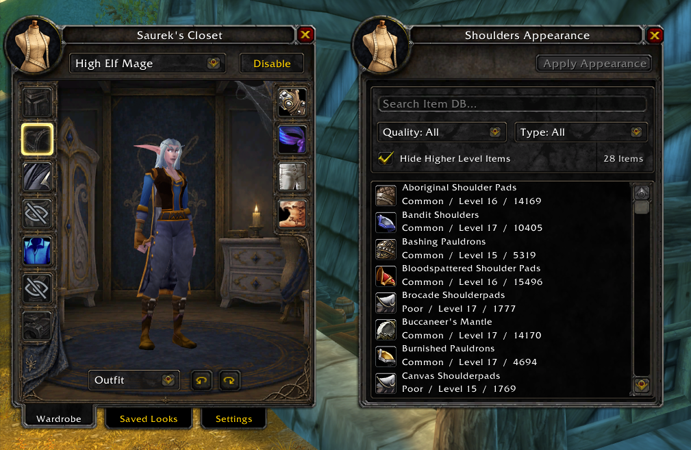
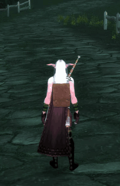
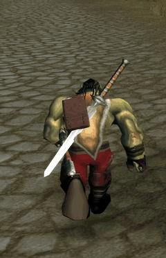
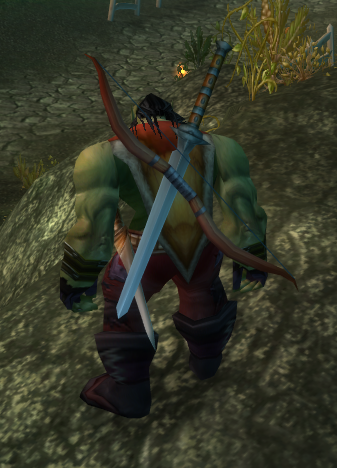
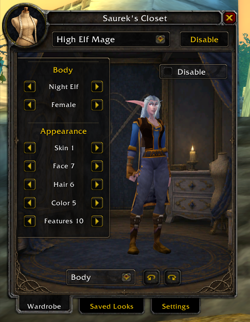
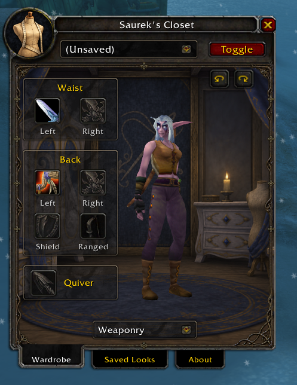
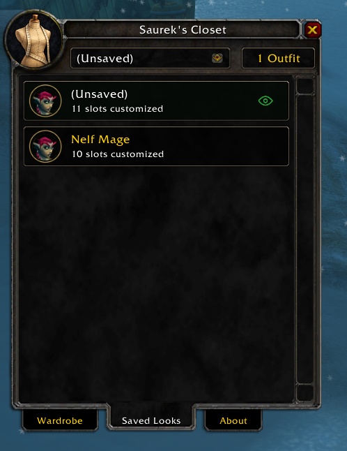

<div align="center">

# Saurek's Closet - A Damn Fine WoW 1.12 Transmog

Saurek proudly presents:

**· Release 4.1.1 · [Download now](https://github.com/mu-arch/SaureksCloset/releases/latest) ·**

Supported on Linux, Windows, and Mac

<a href="https://discord.gg/6mfxCdNbM6"></a>

[Join the Discord community](https://discord.gg/6mfxCdNbM6)

</div>

## Your character, your look

Saurek's Closet morphs how your character looks on your own client, and for others with the addon. Your actual equipment, stats, and gameplay stay the same.

- **Dress your character:** browse the item database, filter by quality and type, and preview an item before activating it.
- **Choose what shows:** customize an armor slot, hide it, or pass through your real equipment.
- **Customize your body:** change race, gender, skin, face, hair, and available features.
- **Arrange your weaponry:** select appearances for both sides of the waist, both sides of the back, a shield, a ranged weapon, and a quiver. Or all at once!
- **See your bags:** Equip and position your bags on your back and hips.
- **Advanced physics:** Optionally enable modern pre-computed (baked) cape, bag, sheathed weapon physics with no runtime performance cost. Watch as jumping, running, falling, and combat motions realistically deform and swing your equipment on your character!
- **Get dirty:** Sweat, dust, mud, and blood. It gets all over you, and you'll need to visit an inn, or take a dip to clean it off.
- **Share your look with others:** If another player has the addon they can see your custom look (if you authorize broadcasting your transmog data)
- **Hair with hats:** No more crop! Wear your hat while still seeing your hairstyle.

## Take a look inside

### Wardrobe & item browser



### Visible Bags with dynamic physics

- Five fixed bag slots, six model choices, four Mageweave Bag colors, and three Slim Leather Bag colors. Choose each bag by its icon, then tune it on the back or either hip.
- Bags stay consistently sized for realism. A Runecloth bag on a gnome would take up their whole back, versus a Tauren that could comfortably fit 4 or more. In the placement tuner you can adjust their size if you want to.
- Hard physics: Hard leather bags rock and bounce realistically, as if they had weight. Jumping/falling causes the bag to tilt and fly up in the air realistically.
- Soft physics: Cloth bags stretch and deform based on your character movements.
- Intelligent strap creation (Not shown in demo gifs) the addon computes a strap line from each bag to the players shoulder and draws it over the player texture in memory.

<table>
<tr>
<td width="50%">

</td>
<td width="50%">

</td>
<td width="50%">

</td>
</tr>
</table>

### Expanded weapon positioning, and fixes for Blizzard's 1.12 weapon sheathing bugs

- Greatly expand your ability to choose where items are placed on the body. Put your fishing rod on your back with a weapon, and your skinning knife on your hip, all at once.

- Or as a hunter see your bow and quiver at all times, even with your sword on your back, and adjust the position of the quiver.



### Body customization



### Weaponry



### Saved Looks



## Installation

### What you need

- The supported **Windows 1.12.1 client, build 5875**. This is not an addon for modern WoW Classic or Retail. Other clients may be possible to be support, open a Github issue.
- **VanillaFixes** configured to launch your game. https://github.com/hannesmann/vanillafixes
- **VanillaHelpers.dll** installed and enabled in `dlls.txt`.
- Both parts of Saurek's Closet: the **`SaureksCloset` addon folder** and **`SaureksCloset.dll`** from the release download.

### Install the release

1. Fully close World of Warcraft and extract the release ZIP.

2. Copy the `SaureksCloset` folder into `Interface/AddOns/`.

3. Open the addon's installation instructions folder. Copy the included `SaureksCloset.dll` into your main game folder, beside `WoW.exe`.

4. Make sure you have https://github.com/hannesmann/vanillafixes Vanilla Fixes installed.

5. Add `SaureksCloset.dll` to `dlls.txt`, after `VanillaHelpers.dll`. Keep any other DLL entries you already use.

6. Launch through VanillaFixes, enable **Saurek's Closet** in the AddOns list, and log in.

Your installation should contain:

```text
World of Warcraft/
├── WoW.exe
├── VanillaHelpers.dll
├── SaureksCloset.dll
├── dlls.txt
└── Interface/
    └── AddOns/
        └── SaureksCloset/
            ├── SaureksCloset.toc
            ├── Textures/
            └── ...
```

**Don't forget the DLL.** Copying only the addon folder is not a complete installation. A UI reload cannot load a new DLL; fully restart the game after replacing one.

## Make your first look

1. Click the minimap button or type **`/closet`**.
2. In **Wardrobe → Outfit**, click an armor slot and choose **Custom Item**, **Hide Slot**, or **Passthrough**.
3. Search or filter the item list. Click an item to preview it, then choose **Apply Appearance** to apply it.
4. Use the bottom dropdown to visit **Body** or **Weaponry** and continue customizing.
5. Click **Save** to update your active saved look. If there is no active saved look, Save opens **Saved Looks** so you can enter a name and click **Save New**.

Open any saved look to preview, rename, delete, or activate it. The green eye marks the active look. Changes display as **Name (Edited)** until saved. **Save** is greyed out when there are no unsaved edits; rotating the preview does not count as an edit. Switching looks warns before discarding unsaved changes. The dropdown at the top of the window lets you switch saved looks quickly. Right-click the minimap button and choose **Toggle Addon** to turn local appearances on or off. Click and drag in either character preview to rotate the model.

### Can I get banned from a private server for using this?

Probably not. Warden could in theory detect it, but I would think it's unlikely considering it only changes player object related properties.

### Privacy Notes

- Saurek's Closet has a "Check for updates" feature that queries this Github page to see if an update is available. This feature can be disabled in settings. It's able to do this while other addons cannot because it uses memory injection to take full control of the game client and escape Blizzard's addon jail.

- If you enable transmog broadcasting so other players with the addon can see your custom look: your (1) server address (2) character GUID (3) character name (4) character object data (5) character position is transmitted to my relay server. The relay server compares all character locations on your game server and determines which players to distribute transmog data to based on proximity. I offer this service for free so please consider a donation

- Can I disable transmog sharing: YES
- Does the transmog system send my account name, password, or personal information: NO
- Can it submit new executable code to the addon: NO
- Why can't you use normal addon channels: I don't want servers to be able to see you're using the addon, also I'm adding support for WoW: Forever and I absolutely don't want Blizzard to see you're using the addon, since it violate TOS. Therefore I'm putting everything under this private communication server so there's one system to maintain.
- Are connections to the server encrypted: YES, but it wouldn't matter if they weren't, no data of any real privacy impact is sent over the network.
- Will this now or ever do anything that a common sense computer professional would consider privacy violation: NO, the scope of communications with this server are to coordinate the distribution of transmog character object data.

## Notice to users of World of Warcraft addons in general

I have personally seen people distributing viruses in the form of WoW addons.

Be careful installing random addons, *especially* ones that utilize DLL injection, because their capabilities are not constrained in any way. DLL injection based programs can: access any file on your computer and store arbitrary data on your computer, transmit and receive data to any website or person, and execute any program or script on your computer.

Saurek's Closet, of course, does not have any malicious functions, and the full source is available and can be verified as such. I simply like to make people aware that it isn't safe to just install anything willy nilly.

NEVER DOWNLOAD SAUREK'S CLOSET FROM ANYWHERE BUT THIS OFFICIAL GITHUB PAGE

## Special thanks

- Ownedcore Community - for their years of research on 1.12 and generous sharing of offsets
- Aeroscripts - for offering advice and years of friendship
- Galo - for offering advice and years of friendship
- Icescythe7 - for offering advice
- Darklinux - for offering advice

## Licensing

### Source Code

Unless otherwise stated, original source code in this repository is licensed
under the **PolyForm Noncommercial License 1.0.0**, which does not grant permission
for commercial use. See [LICENSE](LICENSE) for the full terms and
[LICENSING.md](LICENSING.md) for scope and third-party exceptions.

### Artwork and Assets

Original artwork, textures, graphics, interface artwork, icons, images, audio,
and other creative assets included with Saurek's Closet are proprietary and
separately licensed. They are not covered by the source code license. See
[ASSETS-LICENSE](ASSETS-LICENSE).

Except for installation, use with Saurek's Closet, personal backups, and other
permissions described in that license, these assets may not be extracted,
copied, modified, redistributed, sold, or used in another project without
explicit permission from the copyright holder.


