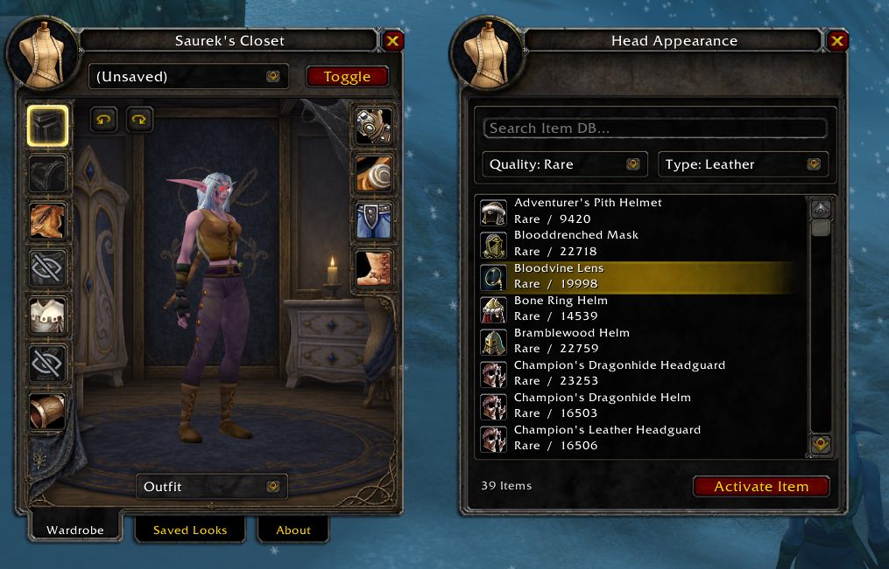
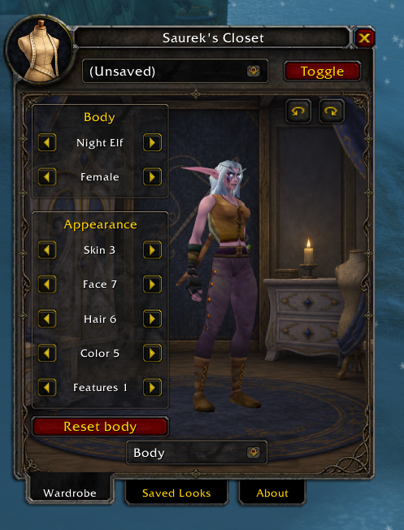
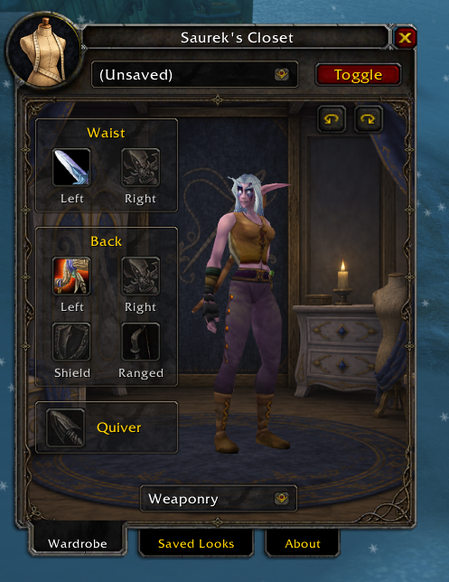
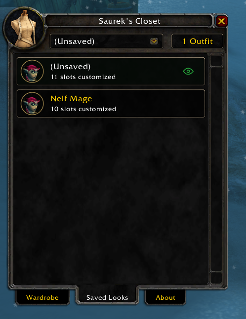

<div align="center">

# Saurek's Closet - A damn fine 1.12.1 Morph

**World of Warcraft 1.12.1 · Build 5875**

<a href="https://discord.gg/6mfxCdNbM6"></a>

[Join the Discord community](https://discord.gg/6mfxCdNbM6)

</div>

## Your character, your look

Saurek's Closet changes how your character looks on your own client. Your actual equipment, stats, and gameplay stay the same; other players do not see these appearance changes.

- **Dress your character:** browse the item database, filter by quality and type, and preview an item before activating it.
- **Choose what shows:** customize an armor slot, hide it, or pass through your real equipment.
- **Customize your body:** change race, gender, skin, face, hair, and available features.
- **Arrange your weaponry:** select appearances for both sides of the waist, both sides of the back, a shield, a ranged weapon, and a quiver.
- **Save your favorites:** name new looks, update existing ones, and switch between them from the quick-selection dropdown.

## Take a look inside

### Wardrobe & item browser



The wardrobe shows your character in a live 3D preview, with armor slots arranged along either side. Click a slot to choose a custom item, hide it, or pass through your real armor. The item browser opens alongside the wardrobe: search the database, narrow the list by quality and type, and click an item to preview it. **Activate Item** applies your selection. The crossed-out eye marks a hidden slot, and **Toggle** switches your local appearance overrides on or off.

### Body customization



### Weaponry



### Saved Looks



## Installation

### What you need

- The supported **Windows 1.12.1 client, build 5875**. This is not an addon for modern WoW Classic or Retail.
- **VanillaFixes** configured to launch your game.
- **VanillaHelpers.dll** installed and enabled in `dlls.txt`.
- Both parts of Saurek's Closet: the **`SaureksCloset` addon folder** and **`SaureksCloset.dll`** from the release download.

### Install the release

1. Fully close World of Warcraft and extract the release ZIP.

2. Copy the `SaureksCloset` folder into `Interface/AddOns/`.

3. Open the addon's **[Installation instructions](Installation%20instructions/)** folder. Copy the included `SaureksCloset.dll` into your main game folder, beside `WoW.exe`. The short [setup guide](Installation%20instructions/READ%20ME.txt) explains where to drag it.

4. Add `SaureksCloset.dll` to `dlls.txt`, after `VanillaHelpers.dll`. Keep any other DLL entries you already use.

5. Launch through VanillaFixes, enable **Saurek's Closet** in the AddOns list, and log in.

Your installation should contain:

```text
World of Warcraft/
├── WoW.exe
├── VanillaHelpers.dll
├── SaureksCloset.dll
├── dlls.txt
└── Interface/
    └── AddOns/
        └── SaureksCloset/
            ├── SaureksCloset.toc
            ├── Textures/
            └── ...
```

**Don't forget the DLL.** Copying only the addon folder is not a complete installation. A UI reload cannot load a new DLL; fully restart the game after replacing one.

The full release also includes an optional Python 3 installer, which verifies the supported client and backs up the files it replaces:

```powershell
py -3 install.py "C:\Games\World of Warcraft"
```

## Make your first look

1. Click the minimap button or type **`/closet`**.
2. In **Wardrobe → Outfit**, click an armor slot and choose **Custom Item**, **Hide Slot**, or **Passthrough**.
3. Search or filter the item list. Click an item to preview it, then choose **Activate Item** to apply it.
4. Use the bottom dropdown to visit **Body** or **Weaponry** and continue customizing.
5. Open **Saved Looks** and select **(Unsaved)**. Enter a name and click **Save new**, or use **Save to existing outfit** to update a favorite.

Open any saved look to preview, rename, delete, or activate it. The green eye marks the active look. The dropdown at the top of the window lets you switch saved looks quickly, and **Toggle** turns your local appearance overrides on or off.

### How weapon placements work

Several custom weapons can be displayed at once. When you draw weapons, matching appearances move into your hands according to the type of weapon actually equipped. A cosmetic gun stays stored if you don't have a gun equipped; unmatched placements and quivers also stay stored.

Weaponry is still being refined. Some combinations may clip, and attachment positions cannot yet be adjusted manually. The **Bags** view is a placeholder; bag appearance customization is not available yet.

